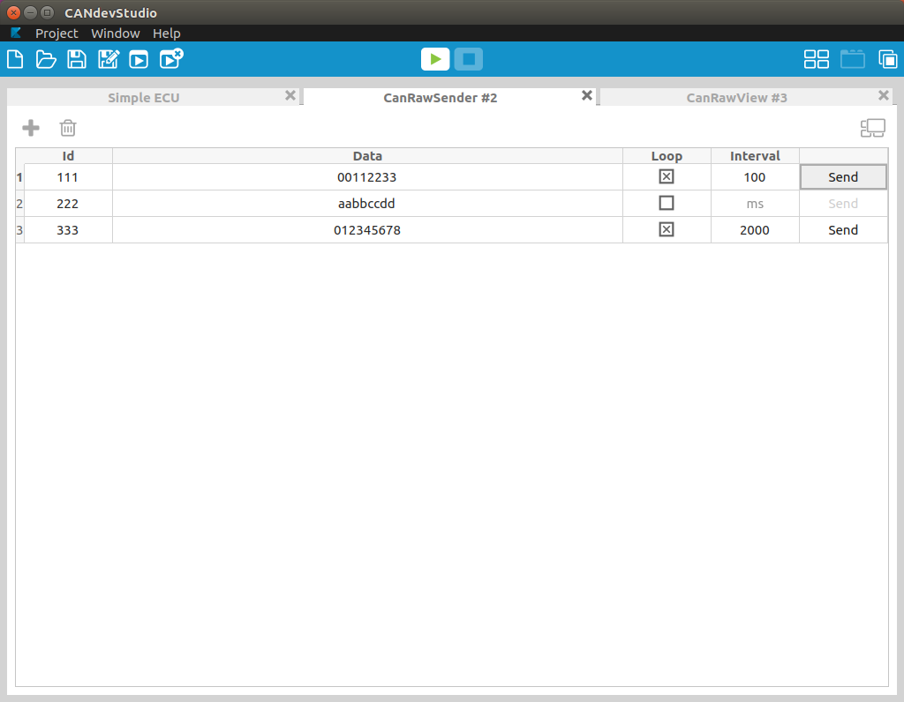

<!-- WARNING: This file is generated by fetch_docs.js using /home/boron/Documents/AGL/docs-webtemplate/site/_data/tocs/apis_services/guppy/candevstudio-developer-guides-api-services-book.yml -->

# Configure a CanRawSender node

CanRawSender node lets you set a predefined list of CAN Raw messages to send.

Click on the + sign to add as much as needed signals to send. For each signals, you has to define:

- the CAN arbitration ID
- Data load
- Loop checkbox make the signal repeat infinitely
- Interval is used with loop to define how much time between 2 sends

Once clicked on ***Play*** button in the main Window to launch the simulation,
then each signals will be sent in the same order than defined in the
CanRawSender node then using interval to repeat themselves.

Signals without ***loop*** checked will not be sent, you have to click manually
on the ***Send*** button to trigger a sending.
