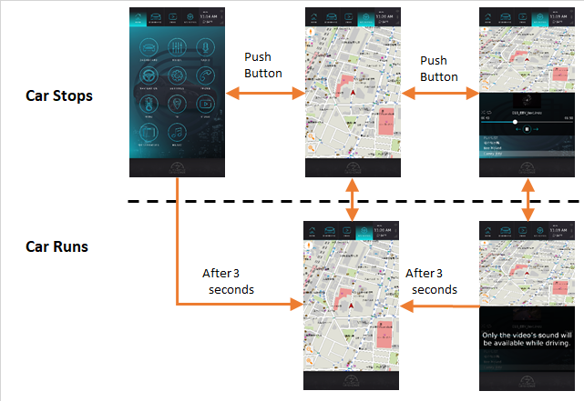
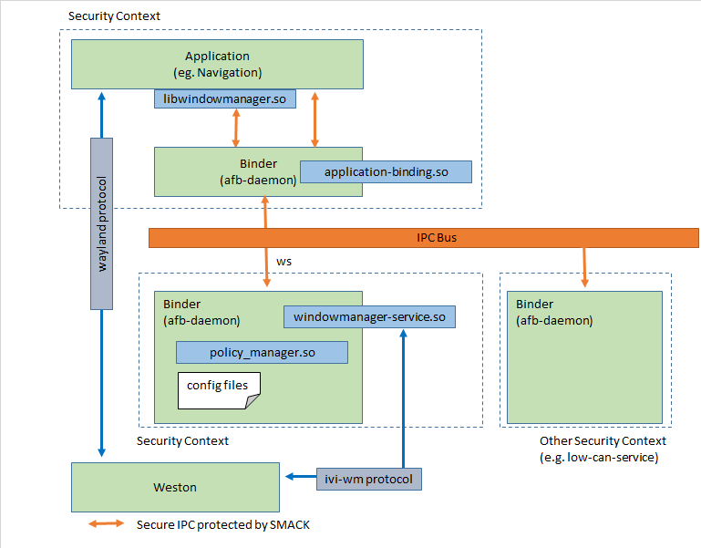
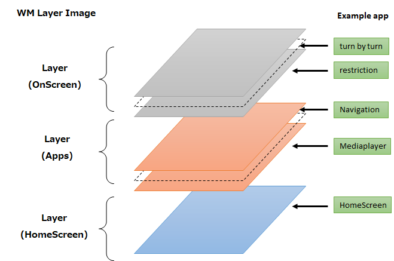
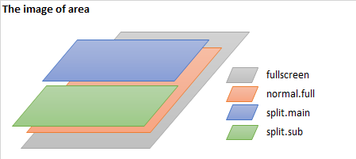
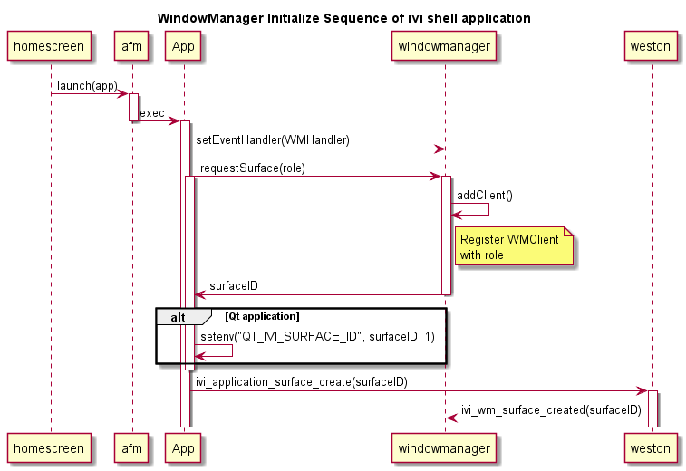
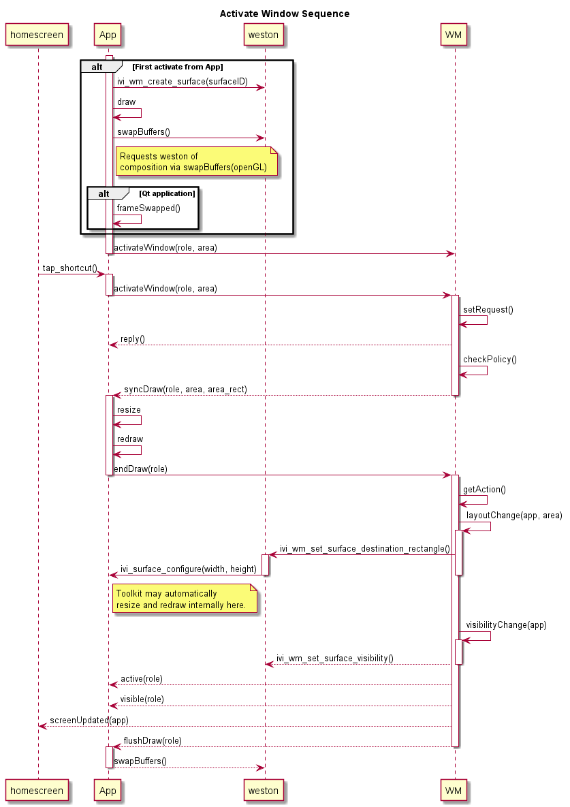
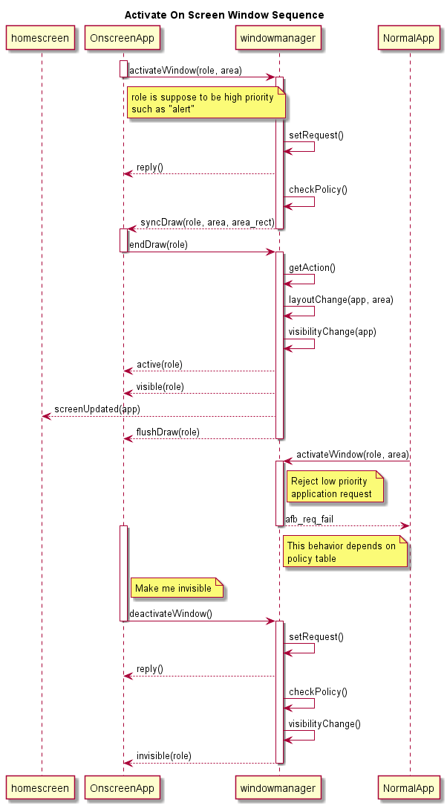
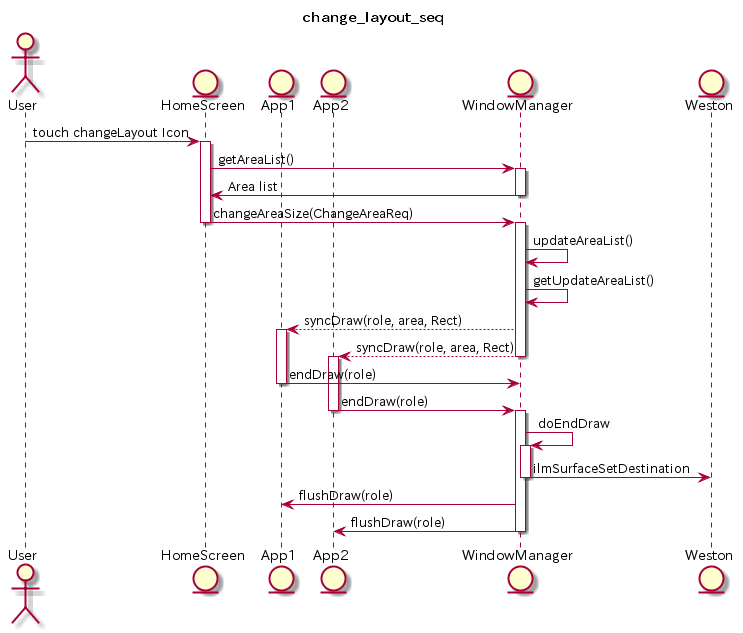
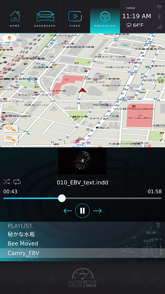

<!-- WARNING: This file is generated by fetch_docs.js using /home/boron/Documents/AGL/docs-webtemplate/site/_data/tocs/apis_services/guppy/agl-service-windowmanager-developer-guides-api-services-book.yml -->

# Window Manager Application Guide

## Table of content

- [Target reader of this document](#Target\ reader\ of\ this\ document)
- [Overview](#Overview)
  - [Supported usecase](#Supported\ usecase)
- [Getting Started](#Getting\ Started)
  - [Build](#Build)
  - [Install](#Install)
  - [Bitbake](#Bitbake)
  - [Enable to call Window Manager](#Enable\ to\ call\ Window\ Manager)
- [Software Architecture](#Software\ Architecture)
- [Sequence](#Sequence)
- [API reference](#API\ reference)
  - [Request to Window Manager](#Request\ to\ Window\ Manager)
  - [Event from Window Manager](#Event\ from\ Window\ Manager)
  - [Client Library](#Client\ library)
- [Sample code](#Sample\ code)
- [Policy Manager](#Policy\ Manager)
  - [Enabling split](#Enabling\ split)
- [Release Note](#Release\ Note)

| Version | Author | Updated at |
|:-:|:-:|:-:|
| 0.8 | TOYOTA MOTOR CORPORATION| 22th/Feb/2019 |

* * *

## Target reader of this document

This document is intended for developers and system integrators who
need to know, how Window manager works and how it is to be used.

### Scope of this Document

This document covers Window manager that was implemented for TMC and
delivered to the Automotive Grade Linux (AGL) project. It includes its
implementation details, concepts of operation, configuration and usage.

It does not include

- document of the underlying architecture, see
  [HMI-Framework](https://wiki.automotivelinux.org/hmiframework).

- document of the AGL application framework and its technologies,
  see [AGL Application
    Framework](https://wiki.automotivelinux.org/agl-distro/app-framework).

- document of HomeScreen, see
  [HomeScreen](./ApplicationGuide.html).

It is highly recommended to have a good understanding of these documents
and projects before using Window manager.

* * *

# Overview

Window Manager is the service process which provides window management based on policy.
And implements a layout switching of applications on
multiple layers and with different layer layouts.
Window Manager is based on ivi layer management from GENIVI and AGL application framework.

Window Manager consists of

- afb-binder
- service binding library
- shared library for policy management
- configuration files

In order to understand Window Manager, the below figure shows the one of typical usecases.
In this example, there are two mode for window management.

1. Window Management in `Car Stops`
1. Window Management in `Car Runs`



The important points are:

- Window transition should be done by Window Manager

 Window Manager switch application displayed on top layer by user operation(touch shortcut button).
 In this example, when an user touches `navigation` shortcut button, Window Manager displays `navigation` and hide `launcher`. Next, when an user touches `videoplayer` shortcut button, Window Manager divides a screen into two parts and display two applications.

- There is a priority `role` for each application.

 Window Manager realizes state transition change based on the policy which consists of `role`.
 According to the state transition table, it controls the visibility of application window, layout change, and so on.
 The reasons why this is necessary are

- to support user driving
- not to disturb a driver concerns on driving for safety

  In this example, for safety, when the car starts running, Window Manager set up the role `videoplayer`
  to be masked and uncontrollable by user not to disturb driver concerns.
  And, for supporting driving, set up `navigation` role to be displayed 3 seconds after the car ran.
  In `Car Run` state, the user can't switch to other application from Navigation application until car stops.

## Supported usecase

1. Window Management
- When an user chooses a different application, Window Manager changes the layout and then displays the application.
- When an user chooses a different application, Window Manager changes the layout and then hides the displayed application.
2. Policy Management
- Window Manager changes layout according to policy table based on `role`.
3. Define Layout by `area` configuration
- Window Manager realizes the abstracted `area` and can resize the window by using it. User can easily edit this configuration.

* * *

## Getting Started

### Build by SDK

```bash
git clone https://gerrit.automotivelinux.org/gerrit/apps/agl-service-windowmanager
cd agl-service-windowmanager
mkdir build
cd build
source <your SDK path> // normally this is /opt/agl-sdk/environment
cmake ..
make
make package
```

The widget package is populated in the 'package' directory.

```bash
ls package/
root  windowmanager-service.wgt
```

### Install

Copy windowmanager-service.wgt to the file system then execute the following command.

```bash
afm-util install windowmanager-service.wgt
```

## Bitbake

You can make Window Manager object files with the following two stage operations.

### Download recipe

```bash
mkdir WORK
cd WORK
repo init -u https://gerrit.automotivelinux.org/gerrit/AGL/AGL-repo
repo sync
```

### Execute Bitbake

```bash
source meta-agl/scripts/aglsetup.sh -m m3ulcb agl-demo hmi-framework
bitbake agl-demo-platform
```

* * *

## Enable to call Window Manager

To call Window Manager, it is important to enable the permission from security framework.
To use Window Manager API, an application or a service shall add the following configuration definition into "config.xml" of your application.

```xml
<feature name="urn:AGL:widget:required-api">
    <param name="windowmanager" value="ws" />
</feature>
```

To call Window Manager function easily, Window Manager provides a library which is called "libwindowmanager".
This library provides a function style API calling interface.
So you can include the libwindowmanager.hpp header file, and can link against this library.
Please also refer to the sample application.

See also our [Sample code](#Sample\ code).

* * *

## Software Architecture

The static relationship with other components is shown below.
The actual logic of Window Manager is the binding in Binder(afb-daemon).
Window Manager is based on AGL application framework,
so the IPC via websocket is protected by AGL application framework.

The upper binder is for the application side security context.
The lower binder is the Window Manager for the server side security context.
Usually an application side binder has some business logic for each application, so the number of binders depend on the number of applications which use Window Manager.
On the other hand, regarding lower binder there is only one module in the system. This binder receives messages from multiple applications.

An application can use libwindowmanager.so to call Window Manager API simply.

Window Manager is based on the GENIVI layer management system.



### Layers

Layers are entities that means the application stack group defined in `layers.json`.
This doesn't mean layer ID defined in GENIVI ivi layer.
The layer ID is used for application itself in Window Manager.
Currently, application can't have multiple surfaces in Window Manager.

### Surfaces

Surfaces are *placed* on layers . The surface
will then be resized to dimensions, according to the name of `areas.json`
application requests by `activateWindow` or policy management.
As default, `normal.full` is set by libwindowmanager for native application.

### Configuration

The window manager is configured with the *layers.json*, *areas.json*, *roles.db* configuration
files. By default they are searched in `${AFM_APP_INSTALL_DIR}/etc/`.

Sample configurations are provided with the window manager
implementation, these samples are installed to ${AFM_APP_INSTALL_DIR}/etc/ .

This configuration is supposed to be configured by policy designer which means OEM or Tier1.

#### layers.json

`layers.json` has three roles.

1. Create application containers `Layer`.
1. Set id range for applications.
1. Attach application to `Layer` according to the role application requests.

The sample configuration is here

```json
{
   "comment": "Surface ID to Layer ID mapping",

   "main_surface": {
      "surface_role": "HomeScreen",
      "comment": "This surface should never be made invisible (The HomeScreen)"
   },

   "mappings": [
      {
         "role": "BackGroundLayer",
         "name": "BackGroundLayer",
         "layer_id": 999,
         "comment": "Single BackGround layer map for the map, radio, music and video"
      },
      {
         "role": "homescreen",
         "name": "FarHomeScreen",
         "layer_id": 1000,
         "comment": "FarHomeScreen is the part of HomeScreen. The z order of this layer is lower than NearHomeScreen"
      },
      {
         "role": "music|video|browser|radio|phone|map|hvac|settings|dashboard|poi|mixer|sdl|launcher|fallback",
         "name": "Apps",
         "layer_id": 1001,
         "comment": "Range of IDs that will always be placed on layer 1001"
      },
      {
         "role": "^on_screen.*",
         "name": "OnScreen",
         "layer_id": 9999,
         "comment": "Range of IDs that will always be placed on the OnScreen layer, that gets a very high 'dummy' id of 9999"
      }
   ]
}
```

Each mapping defines the following items to map corresponding surfaces
to a layer.

- `role` defines what kind of ability the application has. And the application will be attached to `Layer` according to the `role`.
    A regular expression that application drawing names
    are matched against. If applications match this regular expression,
    the surface will be visible on this layer.

- `name` is just a name definition for `Layer`, it has no
    functional use apart from identifying a layer with a name.
- `layer_id` is the id used in GENIVI IVI layer management control.

`Layer` stacks from beginning to end.

The above `Layer` example image is below.



Note:
"fallback" role is the special role. This role is set if the role application requests doesn't exist
in `layers.json`. Then, Window Manager will accept any applications.
If the "fallback" is not set in layers.json, window manager blocks the application displaying in such case.
In such a situation, you have to add your role(application name) at "role" in layers.json.

Note:
`BackGroundLayer` name of `Layer` is exception for work around. This layer is fallback layer not to stop event loop of application when it becomes invisible.
The problem is issued in <https://jira.automotivelinux.org/browse/SPEC-1484>.

#### areas.json

Area means abstract expressions of 2-dimensional size and position.
`areas.json` defines the area which an application is set.

```json
{
    "areas": [
        {
            "name": "fullscreen",
            "rect": {
                "x": 0,
                "y": 0,
                "w": 1080,
                "h": 1920
            }
        },
        {
            "name": "normal.full",
            "rect": {
                "x": 0,
                "y": 218,
                "w": 1080,
                "h": 1488
            }
        },
        {
            "name": "split.main",
            "rect": {
                "x": 0,
                "y": 218,
                "w": 1080,
                "h": 744
            }
        },
        {
            "name": "split.sub",
            "rect": {
                "x": 0,
                "y": 962,
                "w": 1080,
                "h": 744
            }
        }
    ]
}
```

The image of the above setting is described below.



- `name` is an abstract data of rectangle.

- `rect` has 4 arguments. `x`, `y` means the offset from (0, 0) of screen.`w` means the width of the area, and `h` means the height of the area. The dimensions can be specified relative to the screen dimensions.

The dimensions can be specified absolute to the screen dimensions. But if `fullscreen` is not suitable to screen dimensions, Window Manager scales the area automatically.

Note:

`fullscreen` must be set because this is the base size of scaling in Window Manger.

Note:

The direction of the coordinates depends on `transform` in weston.ini.
Currently, agl-demo-platform set `transform=270`.
This suppose to use screen vertically.

#### roles.db

* * *

## Sequence

To understand the sequence between application and window manager, refer to the [spec document](https://wiki.automotivelinux.org/hmiframework).

The typical sequence to render your application, follow the sequence below.

1. Register your role (and request surfaceID)



The above sequence is the initialization phase of your application to use Window Manager.
An Application has to register your `role` to Window Manager. For ivi-shell application, Window Manager generates surfaceID to input it into the function
to create surface. And also it is important for synchronization to get `syncDraw` event for receiving the request for resize and redraw, and notifying Window Manager of `endDraw`, so register callback function with setEventHandler for `syncDraw`.

[requestSurface](#requestSurface)

[setEventHandler](#wm_subscribe)

setEventHandler is API of libwindowmanager. This calls wm_subscribe internally.

2. Display your window



To display your window, your application has to request `activateWindow` with `role` and `area` to Window Manager.
Window Manager checks the app should be visible on the `area` according to the policy table using `role` .
If it is accepted, afb_req_success will be returned, and next Window Manager
will push the event `syncDraw` to applications which will be displayed. If it is denied, afb_req_fail will be returned. In this sample sequence, `syncDraw` is emitted to the apps who requested only,
but this shall be emitted to other applications whose size shall be changed.

[activateWindow](#activateWindow)

[syncDraw](#syncDraw)

[endDraw](#endDraw)

[flushDraw](#flushDraw)

3. Activate OnScreen Window



[deactivateWindow](#deactivateWindow)

[See sample code for more detail about OnScreen Window.](https://gerrit.automotivelinux.org/gerrit/gitweb?p=apps%2Fonscreenapp.git;a=summary)

The above sequence shows the sample of OnScreen Window.
If the role is high priority than NormapApp, Window Manager rejects NormalApp
request when OnScreenApp is displayed.

Note : Above repository is currently empty, so please refer to the sandbox branch.

* * *

## API reference

### Request to Window Manager

| Use | verb | version |
|:-:|:-:|:-:|
| Initialize | requestSurface | from 0.7 |
|            | wm_subscribe | from 0.7 |
|            | requestSurfaceXDG | from 0.7 |
|Activate/Deactivate| activateWindow | from 0.7 |
|            | deactivateWindow | from 0.7 |
|            | endDraw | from 0.7 |
| Change area size | changeAreaSize | from 0.8 |
| Get Infomation | getDisplayInfo | from 0.7 |
|                | getAreaList    | from 0.8 |

Note: We created this table from 0.7

The data of IPC via websocket consists of JSON.
This section describes the verb of API and key.
Normally, the body of requesting API will be here.

### Initialize

#### *requestSurface*

Register your role to Window Manager and get surfaceID for ivi-shell. The role is used for policy management. SurfaceID is supposed to be set to the API `ivi_application_surface_create` of ivi-application protocol or set it to environment variable `QT_IVI_SURFACE_ID` if your app is Qt and integrate ivi-shell.

- verb : "requestSurface"
- argument : {"drawing_name":"your role"}

the value must be selected in layers.json.

argument example :

```json
{
  "drawing_name" : "navigation"
}
```

#### *requestSurfaceXDG*

This API is for XDGLauncher, so it is not necessary for normal application.
XDGLauncher is created for XDG application for desktop app without editing for HMI-Framework.
Please see the repository in detail.
<https://gerrit.automotivelinux.org/gerrit/gitweb?p=staging%2Fxdg-launcher.git;a=summary>

#### *wm_subscribe*

Subscribe the Window Manager's event.
Application must subscribe `syncDraw` event.

- verb : "wm_subscribe"
- argument : {"event" : *event number*}

argument example :

```json
{
  "event" : 5
}
```

The event is abstracted with a number (enumeration).

| Number | Event |
|:-:|:-:|
| 0 | "active" |
| 1 | "inactive" |
| 2 | "visible" |
| 3 | "invisible" |
| 4 | "syncDraw" |
| 5 | "flushDraw" |
| 6 | "screenUpdated" |

### Activate/Deactivate

#### *activateWindow*

Request to display your application with `role` on the `area` to Window Manager.
Window Manager checks the app should be visible on the `area` and change layout according to the policy table using `role` .
If it is accepted, afb_req_success will be returned, and next Window Manager
will push the event `syncDraw` to applications which will be displayed.
If it is denied, afb_req_fail will be returned.

- verb : "activateWindow"
- argument : {"drawing_name" : "your role", "drawing_area" : "your area"}

the value must be selected among layers.json.

argument example :

```json
{
  "drawing_name" : "navigation",
  "drawing_area" : "normal.full"
}
```

#### *deactivateWindow*

Request to hide your application to Window Manager.
This verb is supposed to be used by high priority application which
are for example popup application or system UI application such like alert.
If Window Manager set the priority of popup high in the policy, Window Manager may not hide the popup even if normal applications
send `activateWindow` until popup application send `deactivateWindow` . This behavior depends on the policy table. After this request, Window Manager checks which app should be visible and change layout according to the policy table.

- verb : "deactivateWindow"
- argument : None

#### *endDraw*

Notify Window Manager of application finishes drawing.
This function must be sent in event `syncDraw`.
Otherwise, Window Manager will roll back to previous state and reject your request `activateWindow` .

- verb : "endDraw"
- argument : {"drawing_name" : "your role"}

argument example :

```json
{
  "drawing_name" : "navigation",
}
```

#### *changeAreaSize*

Request to change the size of area and location. Then Window Manager sends `syncDraw` to the applications whose size and location will be changed.
The caller has responsible of appearance of layouts.

The use case of this function is shown in below.
The system application such like HomeScreen call this function, then the layout changes. The trigger may be user request on GUI, or system events and so on.


The sequence is below.



- verb : "changeAreaSize"
- argument : {"areas" : [{"name":"area_name","rect":{"x":int,"y":int,"w":int,"h":int}, ...}]}

Note: Only the application whose role is written in whitelist is allowed to call this API. This is because marcious application can change the layouts. The layout should be controled by system application.

### Get Information

#### *getDisplayInfo*

Get screen information such as resolution.

- verb : "getDisplayInfo"
- argument : None

Return : The screen information will return.

Return example :

```json
{
    "response":{
        "width_pixel":1080,
        "height_pixel":1920,
        "width_mm":320,
        "height_mm":520,
        "scale":1
    },
    "jtype" : "afb-reply",
    "request":{
        "status":"success",
        "info":"success",
        "uuid":"05ae219a-0e56-4f46-af9f-3186a18cb110"
    }
}
```

Note :

"width_mm", "height_mm" is from output which is one of the wayland object.
These items lack reliability, so recommend not to use.

#### *getAreaList*

Get area definition defined in areas.json.

- verb : "getAreaList"
- argument : None

Return : The area definition list.

Return example :

```json
{
  "response":{
    "areas":[
      {
        "name":"on_screen",
        "rect":{
          "x":0,
          "y":218,
          "w":1080,
          "h":1488
        }
      },
      {
        "name":"restriction.split.sub",
        "rect":{
          "x":0,
          "y":962,
          "w":1080,
          "h":744
        }
      }
    ]
  },
  "jtype":"afb-reply",
  "request":{
    "status":"success",
    "uuid":"0e6b8835-0df0-4a34-9718-125e6258b378"
  }
}
```

### Event from Window Manager

| Number | Event | version |
|:-:|:-:|:-:|
| 0 | "active" | from 0.7|
| 1 | "inactive" | from 0.7 |
| 2 | "visible" | from 0.7 |
| 3 | "invisible" | from 0.7 |
| 4 | "syncDraw" | from 0.7 |
| 5 | "flushDraw" | from 0.7 |
| 6 | "screenUpdated" | from 0.7 |

Events also consists of JSON.
The data of event is contained in `data` such like

```json
{
    "event":"windowmanager\/active",
    "date":{
        "drawing_name":"navigation"
    },
    "jtype":"afb-event"
}
```

"event" is the event name.
"data" is the data object from Window Manager and contains
the message of event.
This section describes "event" and the contents of "data".

#### active

This event means when the application becomes active state.

example :

```json
{
  "event":"windowmanager\/active",
  "data":{
    "drawing_name":"launcher"
    }
  },
  "jtype":"afb-event"
}
```

#### inactive

This event means when the application becomes inactive state.

example :

```json
{
  "event":"windowmanager\/inactive",
  "data":{
    "drawing_name":"launcher"
    }
  },
  "jtype":"afb-event"
}
```

#### visible

This event is issued when the application is visible state.

example :

```json
{
  "event":"windowmanager\/visible",
  "data":{
    "drawing_name":"launcher"
    }
  },
  "jtype":"afb-event"
}
```

#### invisible

This event is issued when the application is invisible state.

example :

```json
{
  "event":"windowmanager\/invisible",
  "data":{
    "drawing_name":"launcher"
    }
  },
  "jtype":"afb-event"
}
```

#### syncDraw

This event is issued by Window Manager state change operation in policy to the following cases.

- Your app requested `activateWindow` then your application will be resized or visible.
- Other app requested `activateWindow` then your application will be resized or visible.
- Window Manager change layout due to vehicle condition.

This event is the requests from Window Manager to

- request your app to callback `endDraw` to Window Manager.
- request your app to resize and redraw according to "drawing_area".

This is the abstract word then the real size is given in "drawing_rect".

example :

```json
{
  "event":"windowmanager\/syncDraw",
  "data":{
    "drawing_name":"radio",
    "drawing_area":"normal.full",
    "drawing_rect":{
      "x":0,
      "y":218,
      "width":1080,
      "height":1488
    }
  },
  "jtype":"afb-event"
}
```

An application which gets this event must send `endDraw`.
For details, please see the sequence.

#### flushDraw

This event is issued after Window Manager receives all `endDraw` from applications who recieved `syncDraw` . After this event, Window Manager expects applications to update its surface.

example :

```json
{
  "event":"windowmanager\/flushDraw",
  "data":{
    "drawing_name":"launcher"
    }
  },
  "jtype":"afb-event"
}
```

#### screenUpdated

This event is issued after the visible application changes as a state transition change. This contains resized applications and visible applications. This event is issued to all subscriber. Typical usecase is only for HomeScreen. If HomeScreen has an animation until the started application is visible such as progress bar, this signal may become a switch to stop the animation.

```json
{
  "event":"windowmanager\/screenUpdated",
  "data":{
    "ids":[
      "mediaplayer",
      "navi"
    ]
  },
  "jtype":"afb-event"
}
```

"ids" is the application_id described in config.xml of application.

### Client library

A client library implementation that internally uses the *libafbwsc*, is
provided in the `libwindowmanager`.
This library is for C++ native application.

Regarding more detail, please refer to <https://gerrit.automotivelinux.org/gerrit/gitweb?p=src%2Flibwindowmanager.git;a=summary>

* * *

## Sample code

In order to enable application to activate application(render on layer),
above described steps need to be implemented.

As a minimal example the usage and initialization can look like the
following.

Typical implementation of C++ application.

- Repo: `git clone https://gerrit.automotivelinux.org/gerrit/src/libhomescreen`
  - Path: `sample/simple-egl/main.c`

Typical implementation of Qt application.

- Repo: `git clone https://gerrit.automotivelinux.org/gerrit/apps/radio`
- Repo: `git clone https://gerrit.automotivelinux.org/gerrit/apps/videoplayer`

This is the good example to write more simply for Qt application using QtAGLExtra.

## Policy Manager

### Concepts

Policy Manager decides next layout by using input event data and current state
based on the policy table.

And PolicyManager is plugin for WindowManager.
Therefore the OEMs can replace it.

### Enabling split

Window Manager supports split layout to change policy and `areas.json`.
This section describes how to play split layout. The sample image is here.



To play the split layout,

1. Edit in `policy_manager/CMakeLists.txt` as follows:

```cmake:policy_manager/CMakeList.txt
  #set(STM_DIR stub)
  set(STM_DIR zipc)
```

This results in using source code generated by ZIPC.

1. Set bool value "ON" to TRY_SPLIT_LAYOUT at line 28 in policy_manager/CMakeLists.txt as follows:
  set(TRY_SPLIT_LAYOUT ON CACHE BOOL "Enable to show split layout")
1. compile
1. copy window manager to your board
1. re-install windowmanager and reboot

As a result, if application requests `navi` with `activateWindow` when current layout is `video` or `mediaplayer`, Window Manager change layout to split window. The reverse is true.

Note:

Currently, the policy manager force application change the size even if the application which has the role doesn't have the split design. In that case, the view of application may be ugly. Window Manager supposes that applications may have multi designs according to system design by OEM. For example, if OEM sets 2 pattern layout for `navi`, the application which requests `navi` should have 2 pattern designs.

* * *

## Release Note

### version: 0.8

#### New Feature

- Add Policy Manager

### version: 0.7

#### New Features

- Add API of getting area list and changing area size on runtime

#### Changes

- Reduce binary size to use ilmControl library.
- Change layer management. Client has one ivi-layer and can have multi surfaces.
- Stop conversion table which is compatible with old role to avoid complexity.
- Upgrade bindings v3.
- Add configuration file over-ride mechanism.

#### Limitation

- Only single-surface Qt applications are support through the
  libwindowmanager library. This is a limitation of how Qt creates surface
  IDs for the ivi-application interface.

- Currenly, Window Manager supports only one screen. Dual display is not supported.
- As implemented in sample code, Qt application has to wait requesting `activateWindow` until `frameSwapped` is emitted.
- Qt application conceals, wayland and openGL processes, so it is difficult to call `swapBuffer` after `flushDraw` event described in the architecture document. But no problem if you use toolkit such as Qt, because it is automatically processed between applications and compositor(weston).
- Editing ZIPC is difficult for open source developer due to licence.
