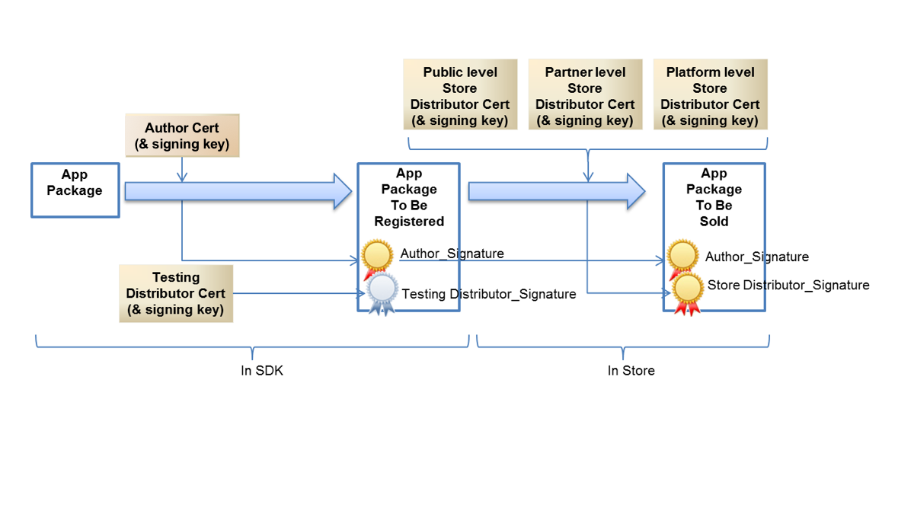

<!-- WARNING: This file is generated by fetch_docs.js using /home/boron/Documents/AGL/docs-webtemplate/site/_data/tocs/architecture/flounder/security_blueprint-flounder-security-blueprint-book.yml -->

# Part 6 - Application

## Abstract

**Application Hardening**: Best practices to apply to the build and release of
user space applications, in order to reduce the number of attack surfaces used
by potential attackers.

The term of Application (App) has a very wide definition in **AGL**. Almost
anything which is not in the core Operating System (OS) is an Application.
Applications can be included in the base software package (image) or can be
added at run-time.

Application containment is achieved using the following protections:

- Linux Native protection
  - Mandatory Access Control (**MAC**)
- AGL Platform protections
  - Origin Tracking and Validation
  - Application Privilege Management and Enforcement via Cynara
  - Authenticated Transport via D-Bus

## Application Types

AGL provides a framework for applications to be written in different forms:

- Web application: HTML5 + JavaScript
- Qt application: in a QML file
- Native application: in C

While there is no harm in providing multiple types of applications, from a
security perspective this does increase the attack surface for an intruder.
The application framework (**AppFw**) consists of a number of utilities and
daemons which provide context for the applications.
Isolation is provided through **SMACK** labels.

## Application Store

Although the Tizen system has defined a [system of App signing and signing flow](https://wiki.tizen.org/Security/Tizen_3.X_Overview#Application_Singing_and_Certificates)
to avoid the spread of unauthorized Apps that might contain malware.
At this point, it is unclear how much of this flow AGL will adopt.
However, judging from the experience, it is an essential topic. For example,
the Google Play Store controls the authorization of Apps through signing, and still,
there are [many accounts of Apps containing malware on the store](http://www.eweek.com/mobile/researchers-find-132-malware-infected-android-apps-on-google-play).

Tizen defines 5 levels of certificates and signing at each level, including an author,
testing distributor, public level store distributor, partner level store distributor,
and platform level store distributor. AGL may define a different number of third parties,
but at a minimum an author and store distributor should be defined.

Once the number of signatures has been established, verification of those signatures needs
to be done at a minimum at installation time on the AGL device. It is important to ensure
the robustness/integrity of the public key used for signature verification. If the public key is modified,
then this compromised key can be used to verify an attacker's private key signature.

Further to this, installation-time verification is limited. Attacks can happen to apps in-memory
at runtime. Any modifications made after installation will be missed by installation-time verification.
Integrity verification that runs during execution makes for a more complete security story.

--------------------------------------------------------------------------------

## Acronyms and Abbreviations

The following table lists the terms utilized within this part of the document.

Acronyms or Abbreviations | Description
------------------------- | ----------------------------------------------------
_3GPP_                    | **3**rd **G**eneration **P**artnership **P**roject
_CASB_                    | **C**loud **A**ccess **S**ecurity **B**roker
_DAST_                    | **D**ynamic **A**pplication **S**ecurity **T**esting
_DPI_                     | **D**eep **P**acket **I**nspection
_IDS_                     | **I**ntrusion **D**etection **S**ystems
_IPS_                     | **I**ntrusion **P**revention **S**ystems
_IPSec_                   | **I**nternet **P**rotocol **Sec**urity
_LSM_                     | **L**inux **S**ecurity **M**odule
_MITM_                    | **M**an **I**n **T**he **M**iddle
_OSI_                     | **O**pen **S**ystems **I**nterconnection
_SATS_                    | **S**tatic **A**pplication **S**ecurity **T**esting
