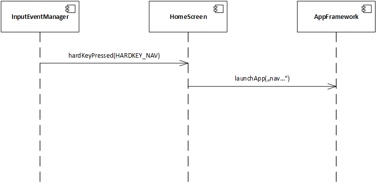
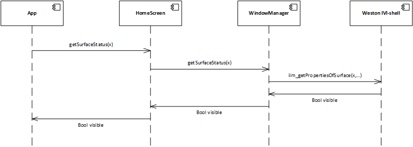
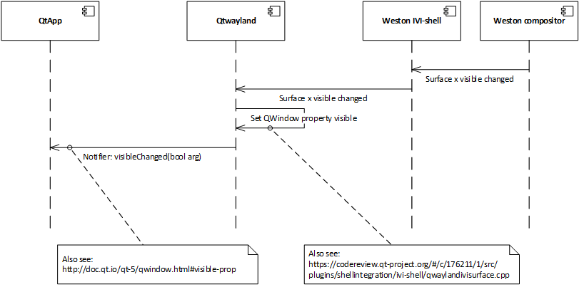
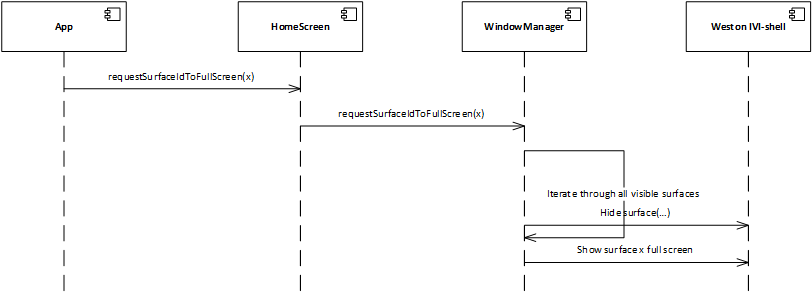
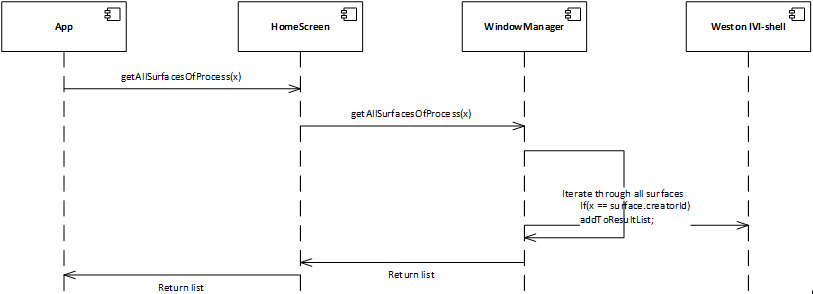
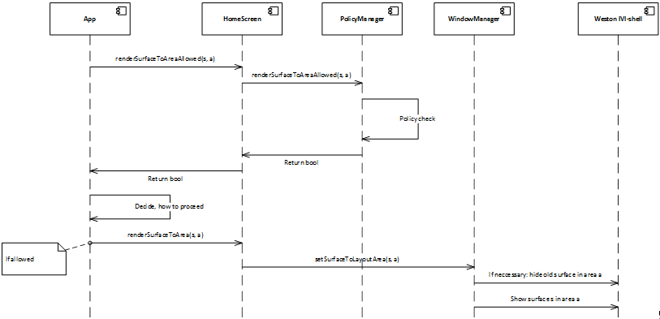
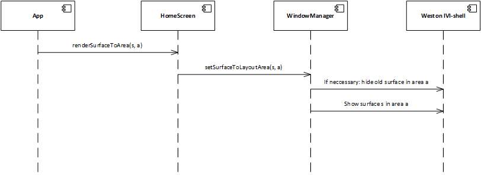

<!-- WARNING: This file is generated by fetch_docs.js using /home/boron/Documents/AGL/docs-webtemplate/site/_data/tocs/apis_services/guppy/homescreen-developer-guides-api-services-book.yml -->

# HomeScreen API
The HomeScreen app provides an own interface for some special use cases concerning the surfaces and user inputs.

The interface is implemented as D-Bus interface.
This is the introspection, describing the interface:

```
<node>
	<interface name="org.agl.homescreen">
		<method name="hardKeyPressed">
			<arg name="key" type="i" direction="in"/>
		</method>
		<method name="getSurfaceStatus">
			<arg name="surfaceId" type="i" direction="in"/>
			<arg name="status" type="i" direction="out"/>
		</method>
		<method name="requestSurfaceIdToFullScreen">
			<arg name="surfaceId" type="i" direction="in"/>
		</method>
		<method name="getAllSurfacesOfProcess">
			<arg name="pid" type="i" direction="in"/>
			<arg name="surfaceIds" type="ai" direction="out"/>
			<annotation name="org.qtproject.QtDBus.QtTypeName.Out0" value="QList&lt;int&gt;"/>
		</method>
		<method name="getLayoutRenderAreaForSurfaceId">
			<arg name="surfaceId" type="i" direction="in"/>
			<arg name="renderArea" type="(iiii)" direction="out"/>
			<annotation name="org.qtproject.QtDBus.QtTypeName.Out0" value="QRect"/>
		</method>
		<method name="renderSurfaceToAreaAllowed">
			<arg name="surfaceId" type="i" direction="in"/>
			<arg name="layoutArea" type="i" direction="in"/>
			<arg name="allowed" type="b" direction="out"/>
		</method>
		<method name="renderSurfaceToArea">
			<arg name="surfaceId" type="i" direction="in"/>
			<arg name="layoutArea" type="i" direction="in"/>
		</method>
	</interface>
</node>
```

These interface will change during further development, so check back frequently.

## User Input Events API calls

### hardKeyPressed

Use hardKeyPressed to inject hard key press events into the HomeScreen app.
This Interface call can be used by applications like the InputEventManager to inject hard keys into the HomeScreen application.

#### Example

if someone presses the Hard Key “NAV” on the target, this key may be injected using this interface to make the HomeScreen launch the navigation application.
Right now, only a few keys are defined (in inputevent.hpp):

```
namespace InputEvent {
    typedef enum HardKey
    {
        HARDKEY_UNDEFINED,
        HARDKEY_NAV,
        HARDKEY_MEDIA
    } eHardKey;
}
```

This will change in the future.
 

 
A “normal” application would not need to call this API.

## Surface control API calls

The normal use case when starting an application is:
The user presses a hard key or uses the app launcher to start an app. The app is then started and is shown full screen.
The org.agl.homescreen API provides some methods to get information about some status and some methods to show surfaces on the screen.

### getSurfaceStatus

A surface can be visible or invisible (please do not confuse “visible” and “visibility”). This function allows to request the current status.

```
<method name="getSurfaceStatus">
	<arg name="surfaceId" type="i" direction="in"/>
	<arg name="status" type="i" direction="out"/>
</method>
```

Right now an application has to pull this information.
This is not optimal and will change in the future. There are two options:

 - The homescreen API will provide a signal that is emitted every time the visible status of surfaces changes. This would be way more efficient, because it would save time and avoid a re-occurring API call. __UPDATE:__ There is a D-Bus signal implemented in this API
 - For Qt, there is already a patch available that provides this information as a base class property. See https://codereview.qt-project.org/#/c/176211/ This would be optimal for Qt widget applications. But not useful for other languages, e.g. Java. __UPDATE:__ This patch got reverted in AGL!

#### Current implementation
 

 
#### Option 1


#### Option 2



### requestSurfaceIdToFullScreen

This function will set the given surface to full screen.

```
<method name="requestSurfaceIdToFullScreen">
	<arg name="surfaceId" type="i" direction="in"/>
</method>
```

It will hide all other surfaces.


 
### getAllSurfacesOfProcess

This returns all surfaces that are created by the given process ID.

```
<method name="getAllSurfacesOfProcess">
	<arg name="pid" type="i" direction="in"/>
	<arg name="surfaceIds" type="ai" direction="out"/>
	<annotation name="org.qtproject.QtDBus.QtTypeName.Out0" value="QList&lt;int&gt;"/>
</method>
```

A process can create more than one surface. By default, the surface with the lowest surface ID is shown on the screen. If an application wants to know all surfaces that were created by an application, this method will provide them.



### renderSurfaceToAreaAllowed

Before calling renderSurfaceToArea, an application can request, if it is allowed to render the surface to this area. This makes sense for an application that would begin to allocate resources to render. But if it is not allowed to render the surface, the application could avoid allocating the resources.

```
<method name="renderSurfaceToAreaAllowed">
	<arg name="surfaceId" type="i" direction="in"/>
	<arg name="layoutArea" type="i" direction="in"/>
	<arg name="allowed" type="b" direction="out"/>
</method>
```

The call will not affect the current setup, it will only request if it is allowed or not.



### renderSurfaceToArea

By default, the HomeScreen application decides, where to render an applications surface. The concept of Layouts defines this. This API call can override the default behavior. An app can request to render a surface in a specific Layout Area.

```
<method name="renderSurfaceToArea">
	<arg name="surfaceId" type="i" direction="in"/>
	<arg name="layoutArea" type="i" direction="in"/>
</method>
```

The surface that was previously rendered in this Layout are will be hidden.



The homescreen interface functionality is not fully implemented, but the API is available. For example using the libhomescreen.so.

### surfaceVisibilityChanged

Whenever the visibility property of a surface changes, this signal is emitted.

```
<signal name="surfaceVisibilityChanged">
	<arg name="surfaceId" type="i"/>
	<arg name="visible" type="b"/>
</signal>
```

Visibility here means visible. The name of the signal is from the Weston surface property “visibility”.
See here for reference: https://github.com/ntanibata/wayland-ivi-extension/blob/master/ivi-layermanagement-api/ilmCommon/include/ilm_types.h
 

