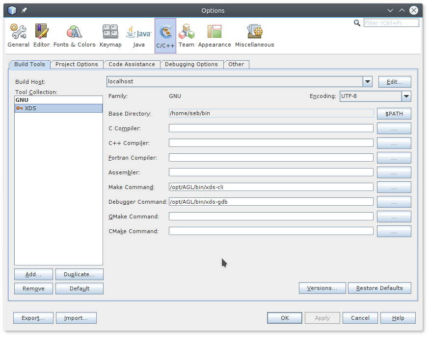

<!-- WARNING: This file is generated by fetch_docs.js using /home/boron/Documents/AGL/docs-webtemplate/site/_data/tocs/devguides/guppy/xds-docs-guides-devguides-book.yml -->

# Build using an IDE

One option for building your application using XDS is to use
an Integrated Development Environment
([IDE](https://en.wikipedia.org/wiki/Integrated_development_environment)).
Many IDEs exist (e.g. [NetBeans](https://netbeans.org/),
[Visual Studio Code](https://code.visualstudio.com/),
[Qt Creator](https://www.qt.io/),
[Eclipse](https://www.eclipse.org/), and so forth).

This section first develops an XDS configuration file
(i.e. `xds-project.conf`) and then provides two
examples, NetBeans and Visual Studio, that do the following.

- NetBeans: Creates two separate build configurations
  for a project, which makes it easy to switch back and forth
  between types of builds.

- Visual Studio: Creates tasks that allow you to build an example
  based on CMake templates.

## XDS Configuration File

This section shows how to create an XDS configuration file
(i.e. `xds-project.conf`) or how to re-use an existing file.
For example, the following commands set up the configuration
file for an `aarch64` SDK to cross-build the
application for a Renesas Gen3 board.

```bash
# create file at root directory of your project
# for example:
# MY_PROJECT_DIR=/home/seb/xds-workspace/helloworld-native-application
cat > $MY_PROJECT_DIR/xds-project.conf << EOF
 export XDS_AGENT_URL=localhost:8800
 export XDS_PROJECT_ID=4021617e-ced0-11e7-acd2-3c970e49ad9b
 export XDS_SDK_ID=c226821b-b5c0-386d-94fe-19f807946d03
EOF
```

## NetBeans

This section creates two configurations: one to compile the
project natively using native GNU gcc, and one to cross-compile
the project using XDS.

Having two configurations allows you to easily switch between them
using NetBean's **Run -> Set Project Configuration** menu.

### Native Configuration

Follow these steps to create the native configuration:

1. Open the **Tools** -> **Options** menu.

2. Open the **C/C++** tab.

3. Click on the **Add** button in the **Build Tools** sub-tab:

   {:: style="width:90%; max-width:700px; margin:auto; display:flex"}

4. Fill the **Make Command** and **Debugger Command** fields to point to the XDS tools:

   {:: style="width:90%; max-width:700px; margin:auto; display:flex"}

5. Click **OK**.

6. Select the **File** -> **New Project** menu item to declare the
   project and create a native configuration.

7. Select **C/C++ Project with Existing Sources** and click on **Next**.

8. Specify your project directory and set **Select Configuration Mode** to
   "Custom".
   Be sure to keep **Tool Collection** set to "Default GNU" in order to create a
   *native configuration*, which is based on the native GNU GCC.

9. Click **Next**.

   {:: style="width:90%; max-width:700px; margin:auto; display:flex"}

10. Update the **Run in Folder** field to add the `build_native` suffix.
    Doing so results in the build files being located in the
    `build_native` sub-directory.
    Be sure to keep the defaults for all other settings and then click **Next**.

    {:: style="width:90%; max-width:700px; margin:auto; display:flex"}

11. Click through **Next** several times while always keeping the
    default settings until the **Finish** button appears.

12. Click **Finish** to complete the creation of the native configuration.

### Cross-Compilation Configuration

Follow these steps to create the configuration for cross-compilation
based on the XDS tools:

1. Edit project properties (using menu **File** -> **Project Properties**)
   to add a new configuration that will use XDS to cross-compile
   your application for example for a Renesas Gen3 board.

2. in the **Build** category, click on **Manage Configurations** button
   and then **New** button to add a new configuration named for example
   "Gen3 board".

   {:: style="width:90%; max-width:700px; margin:auto; display:flex"}

3. Click the **Set Active** button.

4. Select the **Pre-Build** sub-category, and set the following:

   - Working Directory: `build_gen3`
   - Command Line: `xds-cli exec -c ../xds-project.conf -- cmake -DRSYNC_TARGET=root@renesas-gen3 -DRSYNC_PREFIX=/opt ..`
   - Pre-build First: `ticked`<br/><br/>

5. Select the **Make** sub-category, and set the following:

   - Working Directory: `build_gen3`
   - Build Command: `xds-cli exec -c ../xds-project.conf -- make remote-target-populate`
   - Clean Command: `xds-cli exec -c ../xds-project.conf -- make clean`<br/><br/>

   {:: style="width:90%; max-width:700px; margin:auto; display:flex"}

6. Select the **Run** sub-category, and set the following:

   - Run Command: `target/start-on-root@renesas-gen3.sh`
   - Run Directory: `build-gen3`<br/><br/>

   {:: style="width:90%; max-width:700px; margin:auto; display:flex"}

7. Click **OK** to save settings.

By changing the configuration from **Default** to **Gen3 board**, you can
compile your helloworld application natively, which is the default configuration.
Or, you can cross-compile your application using XDS for the Renesas Gen3 board,
which is the Gen3 board configuration.

## Visual Studio Code

This section presents a Visual Studio example that creates tasks
that allow you to build an example that is based on CMake templates.

Follow these steps:

1. Start Visual Studio Code and open your project using the
   following commands:

   ```bash
   cd $MY_PROJECT_DIR
   code . &
   ```

2. Add new tasks by entering the `Ctrl+Shift+P` key combination and selecting
   the `Tasks: Configure Task` command.
   A list of task runner templates appears.

3. Define your own tasks.
   Following is an example that builds the
   [helloworld-native-application](https://github.com/iotbzh/helloworld-native-application)
   that is based on CMake templates.

   ```json
   {
       "version": "2.0.0",
       "type": "shell",
       "presentation": {
           "reveal": "always"
       },
       "tasks": [
           {
               "label": "clean",
               "type": "shell",
               "command": "/bin/rm -rf ${workspaceFolder}/build/* && mkdir -p build && echo Cleanup done.",
               "problemMatcher": []
           },
           {
               "label": "pre-build",
               "type": "shell",
               "group": "build",
               "command": "/opt/AGL/bin/xds-cli exec --rpath build --config xds-project.conf -- cmake -DRSYNC_TARGET=root@renesas-gen3 -DRSYNC_PREFIX=/opt ../",
               "problemMatcher": [
                   "$gcc"
               ]
           },
           {
               "label": "build",
               "type": "shell",
               "group": "build",
               "command": "/opt/AGL/bin/xds-cli exec --rpath build --config xds-project.conf -- make widget",
               "problemMatcher": [
                   "$gcc"
               ]
           },
           {
               "label": "populate",
               "type": "shell",
               "command": "/opt/AGL/bin/xds-cli exec --rpath build --config xds-project.conf -- make widget-target-install",
               "problemMatcher": []
           }
       ]
   }
   ```

4. Run a task by entering the `Ctrl+Shift+P` key combination and
   selecting `Tasks: Run task` and then selecting the specific task.
   For example, select `pre-build` to trigger pre-build task.

5. Optionally add keybindings that trigger tasks.
   Following is an example:

   ```json
   // Build
   {
     "key": "alt+f9",
     "command": "workbench.action.tasks.runTask",
     "args": "clean"
   },
   {
     "key": "alt+f10",
     "command": "workbench.action.tasks.runTask",
     "args": "pre-build"
   },
   {
     "key": "alt+f11",
     "command": "workbench.action.tasks.runTask",
     "args": "build"
   },
   {
     "key": "alt+f12",
     "command": "workbench.action.tasks.runTask",
     "args": "populate"
   },
   ```

   <!-- section-note -->
   **NOTES:**

   - You can find more details about Visual Source Code keybindings
     [here](https://code.visualstudio.com/docs/editor/tasks#_binding-keyboard-shortcuts-to-tasks).

   - You can find more details about Visual Source Code tasks
     [here](https://code.visualstudio.com/docs/editor/tasks).
   <!-- end-section-note -->
