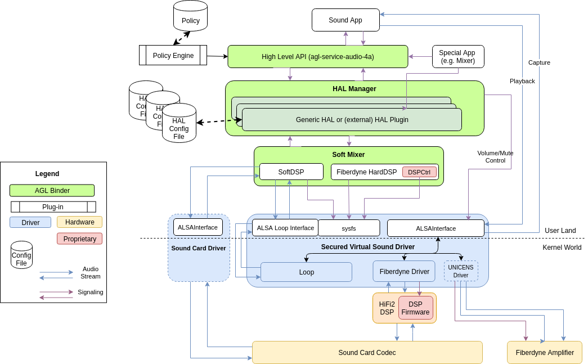
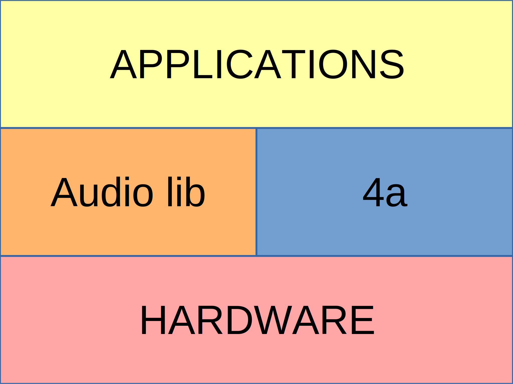
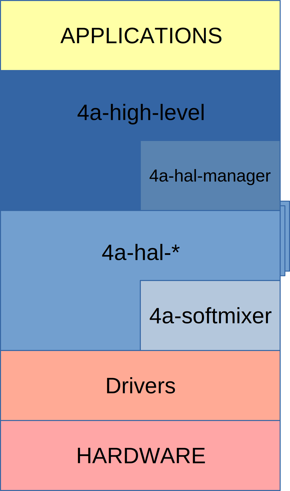

<!-- WARNING: This file is generated by fetch_docs.js using /home/boron/Documents/AGL/docs-webtemplate/site/_data/tocs/apis_services/halibut/agl-service-audio-4a-developer-guides-api-services-book.yml -->

# AGL Advanced Audio Architecture (4a)

## Abstract

4a is an audio framework made to handle automotive use cases like stream
priority and interruptions. It does **not** deal with the audio by itself but
rather with the policies and signaling around it. This means that 4a must be
used in conjunction with an other API that is in charge of the audio stuff,
like **alsa** or **pulseaudio**.

## Architecture

### Global architecture

This detailed diagram shows the interactions between all components.

This diagram shows the global architecture that any application playing audio
should follow. As a developer, when you want to play audio, you rely on APIs
such as alsa, pulseaudio or higher level API(s). To play audio you usually have
some kind of device URI that you have to open in order to write audio data to
it.

4a does **not** change anything about that. You still have to do all of this. 4a
provides permissions, signals and policies. This means that all compliant
applications have to ask 4a for a 'role' when they want to play audio. If 4a
grants them the permission, it returns a device URI that applications have to
open.

Nothing prevent an application to directly open a device, but in this case no
policies can be applied and access permissions are handled by system policies.

### 4a Architecture

Even if applications only deal with the high level API, 4a is made of multiple
components that rely on each other.

The high level API uses the hal-manager to list enabled HALs then it uses
directly those HALs.

HALs rely directly on drivers and/or softmixer.

### Softmixer

The 4a softmixer is a sound server. It is a more secured, more CPU-friendly
server than PulseAudio.

It is mandatory to have a sound server to share a sound card between
several applications, that may write to the sound card at different
sound rates and formats.

It is the responsibility of the 4a-softmixer to instantiate the dmix
alsa plugin, based on the 4A config files.

#### snd-aloop

snd-aloop, which has recently been replaced by a more flexible implementation
(called avirt), proxifies the access from playback application to sound cards.

The 4a-softmixer reads from snd-aloop (or avirt) captures, and will perform
the rate conversion, soft volume control for hardware that does not implement
it, routing to configured audio channels, and mixing at the end.

A security label (SMACK) can be put on the snd-aloop PCM playback devices,
and since each these devices matches an audio role, that applications have to
claim to the 4A high level API, this makes a gatekeeper for audio apps.

snd-aloop introduces one more buffer copy; but the measured performances and
CPU load on the tested boards do not have revealed any unacceptable levels, up
to now.

The CPU load (which could be even better with some unimplemented optimizations
today) is typically less than 5% on the Renesas RCAR board, and similar
numbers have been seen on Intel Atom boards.

#### avirt

Introduced recently on the master branch of AGL, it provides to 4A high level
a common interface for both softmixing, and DSP-accelerated mixing. I also
sets user-readable names to the dynamically-configured playback devices, that
match the 4A audio roles (aka streams).

The avirt-loop backend is a loop implementation that provides the same
functionality as snd-aloop, with enhanced security (each playback has a
dedicated PCM device, on which a SMACK label can be put), and with the
flexibility offered by the top avirt layer.

It is not limited to 8 channels like snd-aloop.

