<!-- WARNING: This file is generated by fetch_docs.js using /home/boron/Documents/AGL/docs-webtemplate/site/_data/tocs/apis_services/icefish/agl-service-soundmanager-developer-guides-api-services-book.yml -->

# **Sound Manager Application Guide**

<div align="right">Revision: 0.3alpha</div>
<div align="right">TOYOTA MOTOR CORPORATION</div>
<div align="right">Advanced Driver Information Technology</div>
<div align="right">11th/Dec/2017</div>

* * *

<div id="Table\ of\ content"></div>

## Table of content

- [Target reader of this document](#Target\ reader\ of\ this\ document)
- [Overview](#Overview)
- [Getting Start](#Getting\ Start)
  - [Supported environment](#Supported\ environment)
  - [Build](#Build)
  - [Configuring](#Configuring)
  - [Additional work](#Additional\ work)
  - [How to call Sound Manager's APIs from your Application?](#How\ to\ call\ Sound\ Manager\ APIs\ from\ your\ Application?)
- [Supported usecase](#Supported\ usecase)
- [Software Architecture](#Software\ Architecture)
- [API reference](#API\ reference)
  - [APIs](#APIs)
  - [Events](#Events)
- [Sequence](#Sequence)
  - [StartUp](#StartUp)
  - [Registration](#Registration)
  - [Request Sound Right](#Request\ Sound\ Right)
  - [Connect Sound Route](#Connect\ Sound\ Route)
  - [Start Sound Streaming](#Start\ Sound\ Streaming)
  - [Stop Sound Streaming](#Stop\ Sound\ Streaming)
  - [Disconnect Sound Route](#Disconnect\ Sound\ Route)
  - [Change Volume](#Change\ Volume)
  - [Set Mute State](#Set\ Mute\ State)
  - [Release Sound Right](#Release\ Sound\ Right)
  - [Audio Domain](#Audio\ Domain)
- [Sample code](#Sample\ code)
- [Limitation](#Limitation)

* * *

<div id="Target\ reader\ of\ this\ document"></div>

## Target reader of this document

Application developer whose software uses sound output.

* * *

<div id="Overview"></div>

## Overview

The sound manager is the service which provides **sound-right management** for multiple sound sources.
This service is based on GENIVI Audio Manager, and this package contains service binding and library for API calling.
The reason why this service is based on GENIVI Audio Manager is because GENIVI Audio Manager supports highly strong and flexible sound-right management function.

In order to understand, the below figure shows the one of typical usecases.
In this example, there are four sound mode.

1. Audio Off
1. Media Player
1. Tel (Ring and talking)
1. TTS (Text To Speech; typically it's used by Navigation sound)

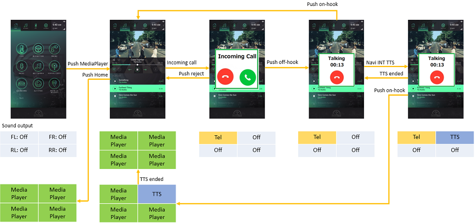

The important points are:

- **There is a priority for each sound source.**
 In this example, the priority of "Tel" and "TTS" is higher than "MediaPlayer". Therefore when the system got incoming call, all four outputs of MediaPlayer are muted automatically by Sound Manager. And in this timing, Sound Manager will issue the event to Media Player, then Media Player can stop the music. (Because depending on OEM's requirement, "Stop" is required.)
 "Tel" and "TTS" have the same priority. So if TTS event happened on talking, each sound will output from independent speaker.
 If on-hook button is touched, Sound Manager will resume previous sound mode. In this example, basically it's MediaPlayer sound. But if TTS still playing, three speaker will output MediaPlayer sound but one speaker will continue to output TTS sound.
- **Sound mode transition should be done by Sound Manager not Applications.**
 Actually application cannot recognize all sound source and its priority, so some centerized manager is required. Sound Manager provides this function. Sound Manager has a database for usecase and priority and in line with this policy Sound Manager controls proper sound mode.

The below links show the example of Sound/Window mode transition.

- [Single window application](Display_Audio_Transition1.html)
 This transition assumes target IVI system support only one window on screen. It's a similar transition to CES2017 demo.
- [Dual window application](Display_Audio_Transition2.html)
 This transition assumes target IVI system support two window (split screen) on screen.

Of course user can customize shortcut menu, but since it's too many states so this example limits shortcut menu as "Home", "MediaPlayer", "HVAC" and "Navigation".

* * *

<div id="Getting\ Start"></div>

## Getting Start

<div id="Supported\ environment"></div>

### Supported environment

| Item        | Description                       |
|:------------|:----------------------------------|
| AGL version | Electric Eel                      |
| Hardware    | Renesas R-Car Starter Kit Pro(M3) |

<div id="Build"></div>

### Build

You can make Sound Manager object files by the following two stage operations.

#### Download recipe

If repo is already done, please start with git clone

```bash
mkdir WORK
cd WORK
repo init -u https://gerrit.automotivelinux.org/gerrit/AGL/AGL-repo
repo sync
```

#### Bitbake

```bash
source meta-agl/scripts/aglsetup.sh -m m3ulcb agl-demo agl-devel agl-appfw-smack agl-hmi-framework
bitbake agl-demo-platform
```

* * *

<div id="Configuring"></div>

### Configuring

To use Sound Manager API, an application shall paste the following configuration definition into "config.xml" of application.

```xml
<feature name="urn:AGL:widget:required-api">
    <param name="soundmanager" value="ws" />
</feature>
```

* * *

<div id="Additional\ work"></div>

### Additional work

#### **Add Policy file**

To add Sound Manager Domain into policy, put the following file to /etc/audiomanager/control on the target rootfs.

`${SOUNDMANAGER_DIR}/conf/audiomanager-config-sample/configuration.xml`

This is a sample configuration.

#### **Remove Module router of Pulse Audio**

Because the module rounter accesses Audio manager for getting sound right instead of application in CES2017, after you changed your application code for Sound manager, you shall modify the configuration for puluse audio not to load module router.
To do this, you shall comment out line.143 of /etc/pulse/default.pa on the target rootfs as below.

```conf
.ifexists module-router.so
#load-module module-router
.endif
```

* * *

<div id="How\ to\ call\ Sound\ Manager\ APIs\ from\ your\ Application?"></div>

### How to call Sound Manager APIs from your Application?

Sound Manager provides a library which is called "libsoundmanager".
This library provides function style API calling interface. So you can include libsoundmanager.hpp headerfile, and can link this library.
Please also refer sample application and template.

See also our [Sample code](#Sample\ code).

* * *

<div id="Supported\ usecase"></div>

## Supported usecase

1. Active source change
- When user choose different audio source with current one, IVI system stop or pause current source and activate new one.
- When user connect external device e.g. iPhone, USB memory IVI system change active source automatically to connected one.
2. Active source locking
- When user is in phone call, IVI restrict to change active source.
3. Interrupt source mixing
- When car close to cross road IVI system reduce the volume of current source and mix with interrupt source e.g. Navigation Guidance.
4. Volume change
- User can change the volume of active source or sink.
- When user change volume during interruption e.g. Navigation Guidance, IVI system change its volume temporary or permanently.
5. Mute/unmute
- User can mute/unmute current active source.
6. Volume management
- When user change active source, IVI system mute/unmute to avoid distortion of sound.
7. Volume acceleration
- When road noise is increased by speed, IVI system automatically change the volume of active source.
8. Routing sound
- System needs to route sound stream to proper zones. (driver zone, passenger zone, rear seat zone)

[See also this page](https://wiki.automotivelinux.org/eg-ui-graphics-req-audiorouting)

* * *

<div id="Software\ Architecture"></div>

## Software Architecture

The architecture of Sound Manager is shown below.
Sound Manager is the service designed to be used by multiple applications.
Therefore Sound Manager framework consists of two binder layers. Please refer the following figure.
The upper binder is for application side security context. The lower binder is for server side security context.
Usually an application side binder has some business logic for each application, so the number of binders depend on the number of applications which use Sound Manager.
On the other hand, regarding lower binder there is only one module in the system. This binder receives messages from multiple applications (in detail, it comes from upper layer binder).

The communication protocols between libsoundmanager and upper binder, upper binder and lower binder,  are WebSocket. The protocols between lower binder (soundmanager-binding) and AudioManager is D-Bus.

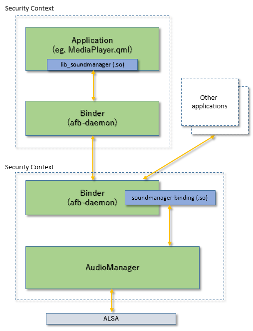

* * *

<div id="API\ reference"></div>

## API reference

"libsoundmanager" and "soundmanager_binding" provides several kinds of APIs, and these APIs basically correspond to GENIVI Audio Manager API. (Some APIs are Sound Manager original functions.)

For understanding, GENIVI Audio Manager stands for one core module and three plug-ins.

1. AudioManagerDaemon
  This is a core module of Audio Manager.
2. AudioManagerCommandPlugin
  This is a command interface for Audio Manager.
3. AudioManagerController
  This plug-in can be used for sound-right management.
4. AudioManagerRountingPlugin
  This plug-in abstracts the hardware and software. And sometimes there may be multiple plug-ins.

*) [See also GENIVI AudioManager Components](http://docs.projects.genivi.org/AudioManager/audiomanagercomponentspage.html)

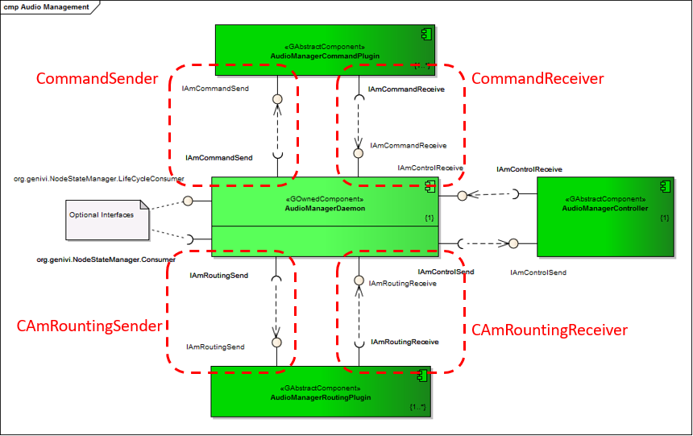
(This figure was copied from GENIVI Web page.)

<div id="APIs"></div>

### APIs

- init(int port, const std::string& token)
- registerSource(const std::string& sourceName)
- connect(int sourceID, int sinkID)
- connect(int sourceID, const std::string& sinkName)
- disconnect(int connectionID)
- ackSetSourceState(int handle, int err)
- registerCallback( void (*event_cb)(const std::string& event, struct json_object* event_contents), void (*reply_cb)(struct json_object* reply_contents), void (*hangup_cb)(void) = nullptr)

Regarding more detail, please refer doxygen documents.

<div id="Events"></div>

### Events

"libsoundmanager" provides the feature which receives the events which an app subscribes with "subscribe" API.
An application can get events to register a callback function with "registerCallback" API.

And this event is subscribed automatically. (See below Note)

- asyncSetSourceState

The below events are available but not mandatory.

- newMainConnection
- removedMainConnection
- mainConnectionStateChanged
- volumeChanged
- sinkMuteStateChanged
- setRoutingReady
- asyncConnect
- asyncDisconnect

Note:

"asyncSetSourceState" is always subscribed in init phase because this is the most important event for audio policy management. This event indicates the approval/disapproval/pause.

Regarding more detail, please refer doxygen documents.

* * *

<div id="Sequence"></div>

## Sequence
<div id="StartUp"></div>

### StartUp

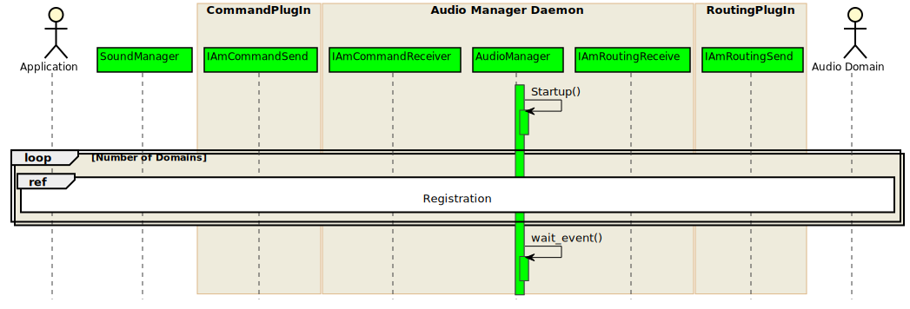

<div id="Registration"></div>

### Registration

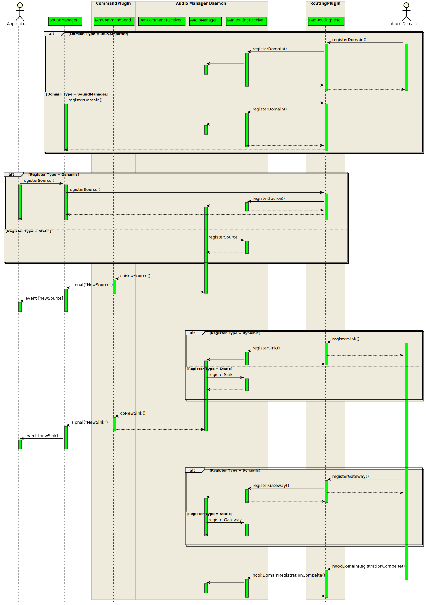

<div id="Request\ Sound\ Right"></div>

### Request Sound Right

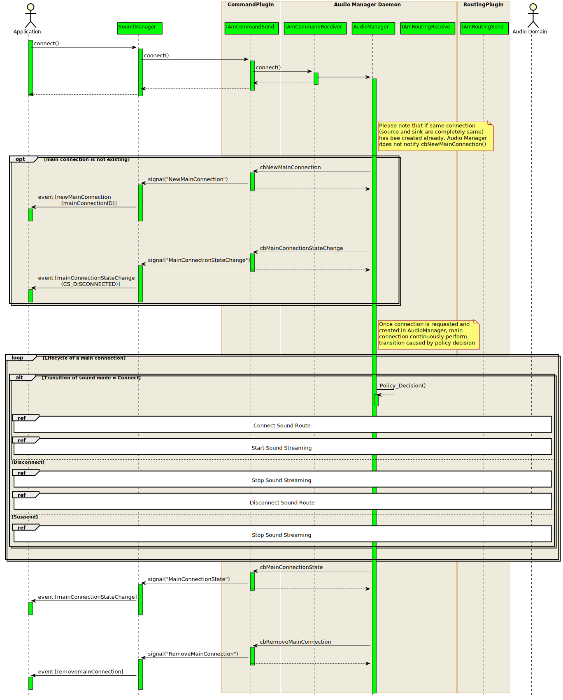

<div id="Connect\ Sound\ Route"></div>

### Connect Sound Route
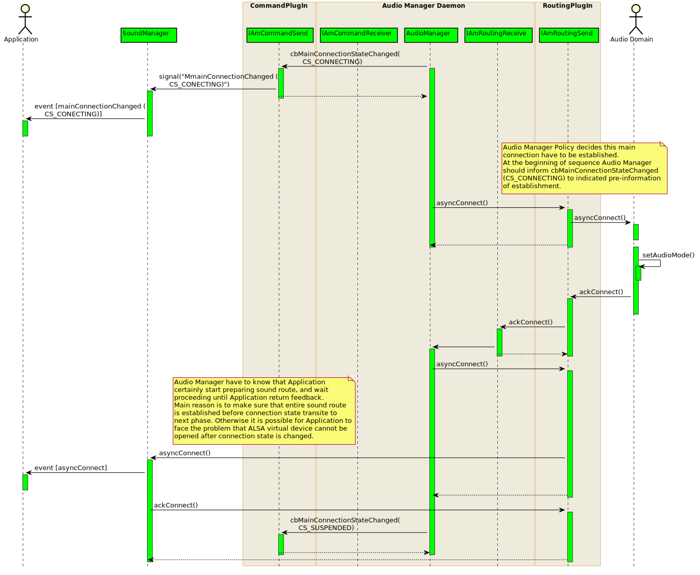

<div id="Start\ Sound\ Streaming"></div>

### Start Sound Streaming

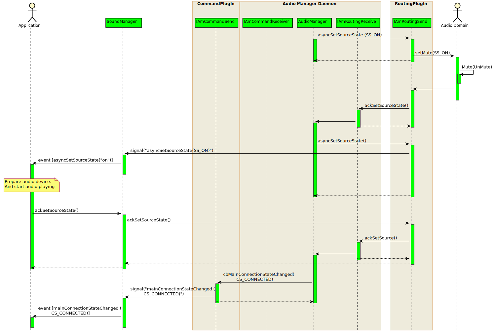

<div id="Stop\ Sound\ Streaming"></div>

### Stop Sound Streaming

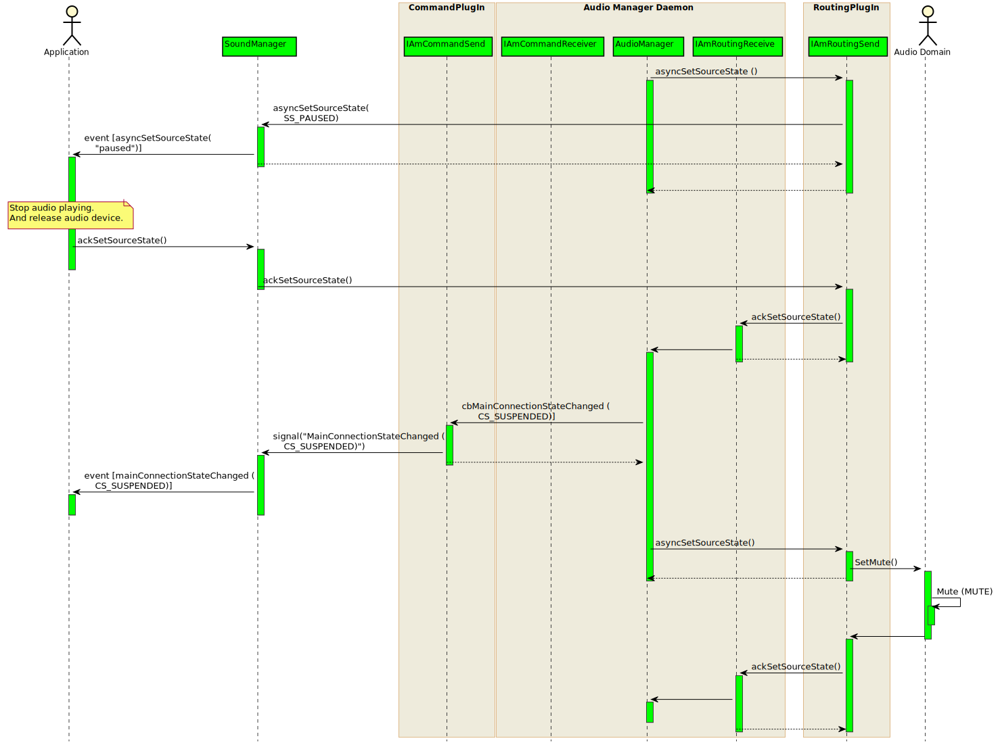

<div id="Disconnect\ Sound\ Route"></div>

### Disconnect Sound Route

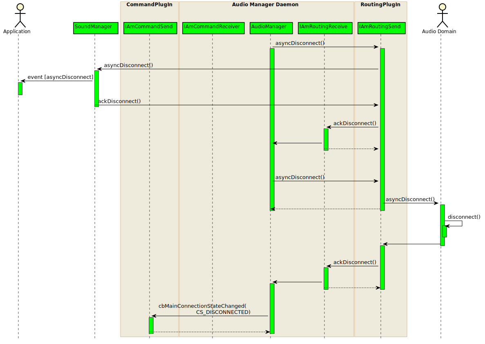

<div id="Change\ Volume"></div>

### Change Volume

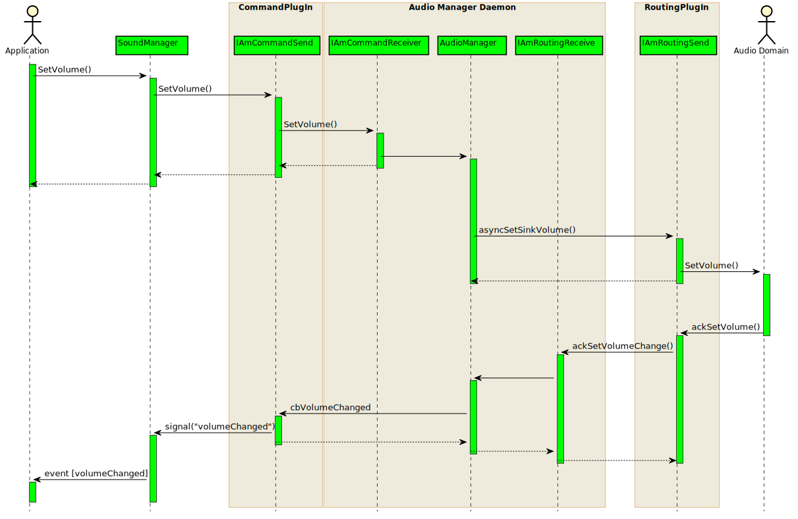

<div id="Set\ Mute\ State"></div>

### Set Mute State

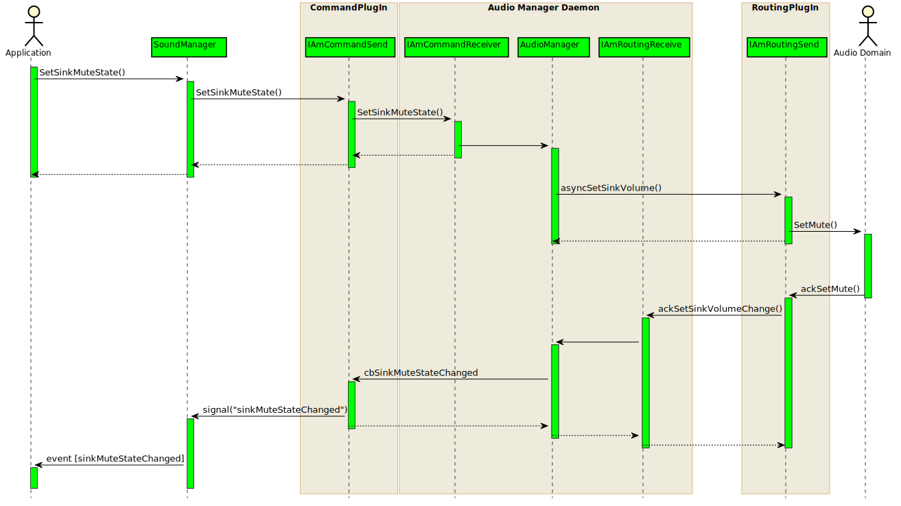

<div id="Release\ Sound\ Right"></div>

### Release Sound Right

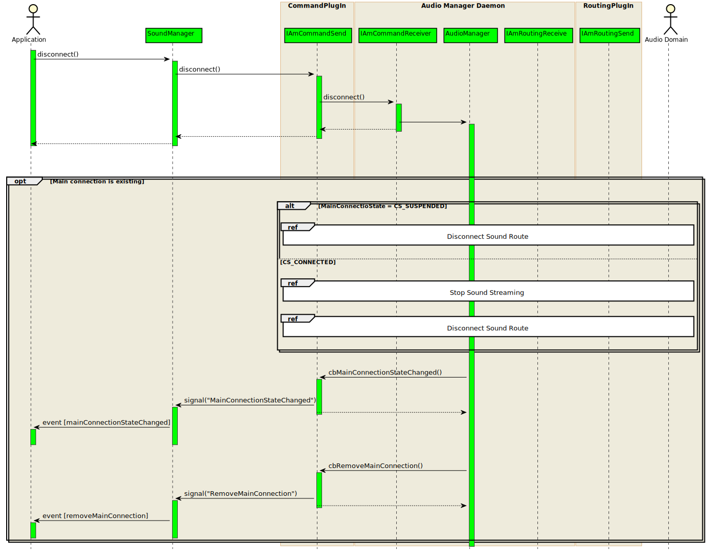

* * *

<div id="Audio\ Domain"></div>

### Audio Domain

One of the most important concept of Audio Manager is Audio Domain.
To use GENIVI Audio Manager based system, it may be better to understand this concept.
The below document should bring good understanding.

[GENIVI Audio Manager: Generic Controller Plug-in](http://events.linuxfoundation.org/sites/events/files/slides/AGL_AMM_presentation_A01.pdf)

Although strongly recommended to read whole pages, but you can get quick understanding by page.10 to 14.

<div id="Sample\ code"></div>

## Sample code

You can find samples using Sound Manager as below.

- `apps/agl-service-homescreen-2017/sample/template`
- `apps/radio (branch=sandbox/knimitz/hmi-framework)`

<div id="Limitation"></div>

## Limitation

- Sound of application is not automatically muted for now because Audio Manager doesn't stop with current plugins. Just notify stop/pause/play.
